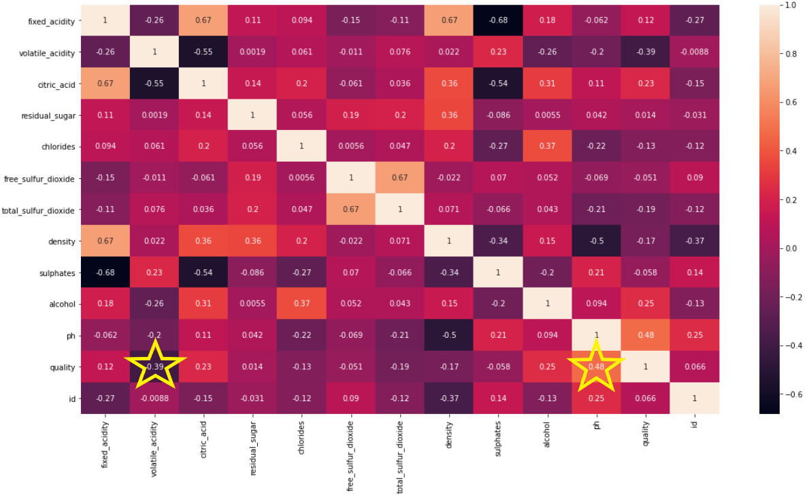
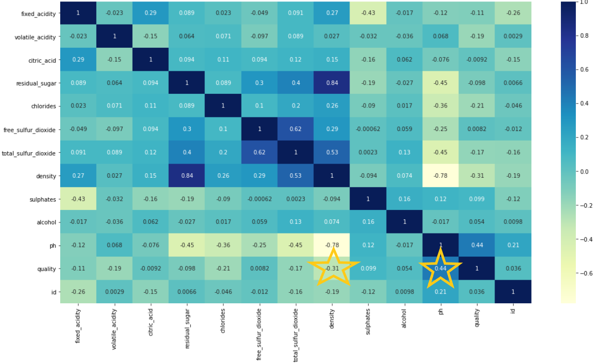

# Modeling Wine Quality with Machine Learning

https://qian8988.github.io/Final-Project-Team-7/

## Using machine learning to predict wine quality

Topic: Predicting wine ratings for red and white wines.

### Project Overview

The goal of our project was to compare the performance of various machine learning classification models. The data used are quality ratings for red and white wine based on 11 physicochemical measurements in the wines. Red and white 
                  wine models are analyzed separately. There are 11 features for each wine type. Ten machine learning models were used.

Red Wine Dataset: https://www.kaggle.com/piyushgoyal443/red-wine-dataset

White Wine Dataset: https://www.kaggle.com/piyushagni5/white-wine-quality

Question we hope to answer: Which classifier predicted wine ratings the best for red and white wines?

Database Engine: PostGreSQL

List of Tables and Columns: Red Wine Quality, White Wine Quality

- 1 - fixed acidity

- 2 - volatile acidity

- 3 - citric acid

- 4 - residual sugar

- 5 - chlorides

- 6 - free sulfur dioxide

- 7 - total sulfur dioxide

- 8 - density

- 9 - pH

- 10 - sulphates

- 11 - alcohol

- Output variable (based on sensory data):

- 12 - quality (score between 0 and 10)

Model: Classifier - Convert the quality score to "good" (rated >= 7) or "not good" (rated < 7)

- Red and white wine csv files imported separately then combined into a PostGreSQL database using pgadmin.  (Instructions in the sql code - **wines.sql**). The data were very clean and required no ETL in the SQL code.

- Preliminary data pre-processing began with checking the dataset for any null values or missing data.  We then recoded our dataset for wines with a quality score greater than or equal to 7; this creates a binary outcome that we can use for our various machine learning models.  The "id" and "color" columns were removed because these values did not affect the outcome rating.  (**all_models_EDA.ipynb**)

- Before we split the data for training/testing, we first scaled the data using the StandardScaler (Mean=0, SD=1). This allows for comparison of all model results. This created the X_scaled dataset which was converted into X_train, X_test, y_train, and y_test.  

- Code run for red and white wines separately (**all_models_red.ipynb and all_models_white.ipynb**)
- The model choices we used in this analysis include the following:

**Logistic:** _Benefits_ - Simple to implement and effective; it works with feature scaling but does not require it.  _Limitations_ - Poor performance on non-linear data or where features are not highly correlated.

**SVM:** _Benefits_ - Does better at handling a higher number of features.  Useful when classes can be easily separated.  Outliers have less impact.  _Limitations_ - For larger datasets, it requires a large amount of time to process.  In the case of overlapped classes it does nt perform well.

**Decision Tree:** _Benefits_ - Scaling or normalization of data is not required.  Can handle missing values.  _Limitations_ Prone to overfitting.  Higher time required to train decision trees.

**Random Forest:** _Benefits_ - Less prone to overfitting.  _Limitations_ - Features need to have some predictive power or else they wont work.

**Gradient Boosted Tree:** _Benefits_ - Often provides more predictive accuracy. Lots of flexibility. No data pre-processing required. - _Limitations_ - Training generally takes longer. It will continue improving to minimize all errors. This can overemphasize outliers and cause overfitting.

**Logisitic-Random Oversampling:** _Benefits_ - Randomly duplicate examples in the minority class. This makes it simple to implement and fast to execute. _Limitations_ - Increase in training time for the classifier and can lead to model overfitting.

**Logistic-SMOTE:** _Benefits_ -  Less likely to overfit. Seems to work well with low dimensional data. _Limitations_ - SMOTE does not take into consideration neighboring examples can be from other classes. This can increase the overlapping of classes and can introduce additional noise.

**Logistic-Cluster Centroid Under Sampling:** _Benefits_ - Less likely to overfit. _Limitations_ - The result of the analysis may be less accurate.

**Balanced Random Forest Classifier:** _Benefits_ - It reduces overfitting problem in decision trees and also reduces the variance and therefore improves the accuracy.  _Limitations_ -  Requires much more computational power and resources. Longer Training Period.

**Easy Ensemble AdaBoos Classifier:** _Benefits_ - Fast, simple, and easy to program. Also, it has the flexibility to be combined with any machine learning algorithm. _Limitations_ - Weak classifiers can lead to overfitting. 

-   Tableau Public link for dashboard so far: https://public.tableau.com/app/profile/paula.l6166/viz/WineDashboard_16366700927230/Winestory

### Red Wine Heat Map

Looking across the quality rating row there are two features with the highest correlations. The correlation for pH is positive = 0.48. As the pH level of wine increases the rating also increases. Volatile acidity has the largest negative correlation = -0.39. Quality ratings decrease as volatile acidity increases.

### White Wine Heat Map

Looking across the quality rating row for white wine there are two features with the highest correlations. The correlation for pH is positive = 0.44. As the pH level of white wine increases the rating also increases. Desity has the largest negative correlation = -0.31. Quality ratings decrease as density increases.

